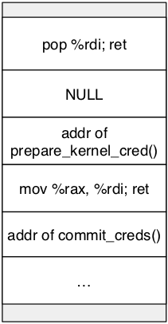

# Change Self

内核会通过进程的 `task_struct` 结构体中的 cred 指针来索引 cred 结构体，然后根据 cred 的内容来判断一个进程拥有的权限，如果 cred 结构体成员中的 uid-fsgid 都为 0，那一般就会认为进程具有 root 权限。

```c
struct cred {
	atomic_t	usage;
#ifdef CONFIG_DEBUG_CREDENTIALS
	atomic_t	subscribers;	/* number of processes subscribed */
	void		*put_addr;
	unsigned	magic;
#define CRED_MAGIC	0x43736564
#define CRED_MAGIC_DEAD	0x44656144
#endif
	kuid_t		uid;		/* real UID of the task */
	kgid_t		gid;		/* real GID of the task */
	kuid_t		suid;		/* saved UID of the task */
	kgid_t		sgid;		/* saved GID of the task */
	kuid_t		euid;		/* effective UID of the task */
	kgid_t		egid;		/* effective GID of the task */
	kuid_t		fsuid;		/* UID for VFS ops */
	kgid_t		fsgid;		/* GID for VFS ops */
  ...
}
```

因此，思路就比较直观了，我们可以通过以下方式来提权

- 直接修改 cred 结构体的内容
- 修改 task_struct 结构体中的 cred 指针指向一个满足要求的 cred

无论是哪一种方法，一般都分为两步：定位，修改。这就好比把大象放到冰箱里一样。

## 直接改 cred

### 定位具体位置

我们可以首先获取到 cred 的具体地址，然后修改 cred。

#### 定位

定位 cred 的具体地址有很多种方法，这里根据是否直接定位分为以下两种

##### 直接定位

cred 结构体的最前面记录了各种 id 信息，对于一个普通的进程而言，uid-fsgid 都是执行进程的用户的身份。因此我们可以通过扫描内存来定位 cred。

```c
struct cred {
	atomic_t	usage;
#ifdef CONFIG_DEBUG_CREDENTIALS
	atomic_t	subscribers;	/* number of processes subscribed */
	void		*put_addr;
	unsigned	magic;
#define CRED_MAGIC	0x43736564
#define CRED_MAGIC_DEAD	0x44656144
#endif
	kuid_t		uid;		/* real UID of the task */
	kgid_t		gid;		/* real GID of the task */
	kuid_t		suid;		/* saved UID of the task */
	kgid_t		sgid;		/* saved GID of the task */
	kuid_t		euid;		/* effective UID of the task */
	kgid_t		egid;		/* effective GID of the task */
	kuid_t		fsuid;		/* UID for VFS ops */
	kgid_t		fsgid;		/* GID for VFS ops */
  ...
}
```

**在实际定位的过程中，我们可能会发现很多满足要求的 cred，这主要是因为 cred 结构体可能会被拷贝、释放。**一个很直观的想法是在定位的过程中，利用 usage 不为 0 来筛除掉一些 cred，但仍然会发现一些 usage 为 0 的 cred。这是因为 cred 从 usage 为 0， 到释放有一定的时间。此外，cred 是使用 rcu 延迟释放的。

##### 间接定位

###### task_struct

进程的 `task_struct` 结构体中会存放指向 cred 的指针，因此我们可以

1. 定位当前进程  `task_struct` 结构体的地址

2. 根据 cred 指针相对于 task_struct 结构体的偏移计算得出 `cred` 指针存储的地址

3. 获取 `cred` 具体的地址

###### comm

comm 用来标记可执行文件的名字，位于进程的 `task_struct` 结构体中。我们可以发现 comm 其实在 cred 的正下方，所以我们也可以先定位 comm ，然后定位 cred 的地址。

```c
	/* Process credentials: */

	/* Tracer's credentials at attach: */
	const struct cred __rcu		*ptracer_cred;

	/* Objective and real subjective task credentials (COW): */
	const struct cred __rcu		*real_cred;

	/* Effective (overridable) subjective task credentials (COW): */
	const struct cred __rcu		*cred;

#ifdef CONFIG_KEYS
	/* Cached requested key. */
	struct key			*cached_requested_key;
#endif

	/*
	 * executable name, excluding path.
	 *
	 * - normally initialized setup_new_exec()
	 * - access it with [gs]et_task_comm()
	 * - lock it with task_lock()
	 */
	char				comm[TASK_COMM_LEN];
```

然而，在进程名字并不特殊的情况下，内核中可能会有多个同样的字符串，这会影响搜索的正确性与效率。因此，我们可以使用 prctl 设置进程的 comm 为一个特殊的字符串，然后再开始定位 comm。

#### 修改

在这种方法下，我们可以直接将 cred 中的 uid-fsgid 都修改为 0。当然修改的方式有很多种，比如说

- 在我们具有任意地址读写后，可以直接修改 cred。
- 在我们可以 ROP 执行代码后，可以利用 ROP gadget 修改 cred。

### 间接定位

虽然我们确实想要修改 cred 的内容，但是不一定非得知道 cred 的具体位置，我们只需要能够修改 cred 即可。

#### （已过时）UAF 使用同样堆块

如果我们在进程初始化时能控制 cred 结构体的位置，并且我们可以在初始化后修改该部分的内容，那么我们就可以很容易地达到提权的目的。这里给出一个典型的例子

1. 申请一块与 cred 结构体大小一样的堆块
2. 释放该堆块
3. fork 出新进程，恰好使用刚刚释放的堆块
4. 此时，修改 cred 结构体特定内存，从而提权

但是**此种方法在较新版本内核中已不再可行，我们已无法直接分配到 cred\_jar 中的 object**，这是因为 cred\_jar 在创建时设置了 `SLAB_ACCOUNT` 标记，在 `CONFIG_MEMCG_KMEM=y` 时（默认开启）**cred\_jar 不会再与相同大小的 kmalloc-192 进行合并**

```c
void __init cred_init(void)
{
	/* allocate a slab in which we can store credentials */
	cred_jar = kmem_cache_create("cred_jar", sizeof(struct cred), 0,
			SLAB_HWCACHE_ALIGN|SLAB_PANIC|SLAB_ACCOUNT, NULL);
}
``` 

## 修改 cred 指针

### 定位具体位置

在这种方式下，我们需要知道 cred 指针的具体地址。

#### 定位

##### 直接定位

显然，cred 指针并没有什么非常特殊的地方，所以很难通过直接定位的方式定位到 cred 指针。

##### 间接定位

###### task_struct

进程的 `task_struct` 结构体中会存放指向 cred 的指针，因此我们可以

1. 定位当前进程  `task_struct` 结构体的地址

2. 根据 cred 指针相对于 task_struct 结构体的偏移计算得出 `cred` 指针存储的地址

###### common

comm 用来标记可执行文件的名字，位于进程的 `task_struct` 结构体中。我们可以发现 comm 其实在 cred 指针的正下方，所以我们也可以先定位 comm ，然后定位 cred 指针的地址。

```c
	/* Process credentials: */

	/* Tracer's credentials at attach: */
	const struct cred __rcu		*ptracer_cred;

	/* Objective and real subjective task credentials (COW): */
	const struct cred __rcu		*real_cred;

	/* Effective (overridable) subjective task credentials (COW): */
	const struct cred __rcu		*cred;

#ifdef CONFIG_KEYS
	/* Cached requested key. */
	struct key			*cached_requested_key;
#endif

	/*
	 * executable name, excluding path.
	 *
	 * - normally initialized setup_new_exec()
	 * - access it with [gs]et_task_comm()
	 * - lock it with task_lock()
	 */
	char				comm[TASK_COMM_LEN];
```

然而，在进程名字并不特殊的情况下，内核中可能会有多个同样的字符串，这会影响搜索的正确性与效率。因此，我们可以使用 prctl 设置进程的 comm 为一个特殊的字符串，然后再开始定位 comm。

#### 修改

在具体修改时，我们可以使用如下的两种方式

- 修改 cred 指针为内核镜像中已有的 init_cred 的地址。这种方法适合于我们能够直接修改 cred 指针以及知道 init_cred 地址的情况。
- 伪造一个 cred，然后修改 cred 指针指向该地址即可。这种方式比较麻烦，一般并不使用。

### 间接定位

#### commit_creds(&init_cred)

`commit_creds()` 函数被用以将一个新的 cred 设为当前进程 task_struct 的 real_cred 与 cred 字段，因此若是我们能够劫持内核执行流调用该函数并传入一个具有 root 权限的 cred，则能直接完成对当前进程的提权工作：

```c
int commit_creds(struct cred *new)
{
	struct task_struct *task = current;//内核宏，用以从 percpu 段获取当前进程的 PCB
	const struct cred *old = task->real_cred;

	//...
	rcu_assign_pointer(task->real_cred, new);
	rcu_assign_pointer(task->cred, new);
```

在内核初始化过程当中会以 root 权限启动 `init` 进程，其 cred 结构体为**静态定义**的 `init_cred`，由此不难想到的是我们可以通过 `commit_creds(&init_cred)` 来完成提权的工作

```c
/*
 * The initial credentials for the initial task
 */
struct cred init_cred = {
	.usage			= ATOMIC_INIT(4),
#ifdef CONFIG_DEBUG_CREDENTIALS
	.subscribers		= ATOMIC_INIT(2),
	.magic			= CRED_MAGIC,
#endif
	.uid			= GLOBAL_ROOT_UID,
	.gid			= GLOBAL_ROOT_GID,
	.suid			= GLOBAL_ROOT_UID,
	.sgid			= GLOBAL_ROOT_GID,
	.euid			= GLOBAL_ROOT_UID,
	.egid			= GLOBAL_ROOT_GID,
	.fsuid			= GLOBAL_ROOT_UID,
	.fsgid			= GLOBAL_ROOT_GID,
	.securebits		= SECUREBITS_DEFAULT,
	.cap_inheritable	= CAP_EMPTY_SET,
	.cap_permitted		= CAP_FULL_SET,
	.cap_effective		= CAP_FULL_SET,
	.cap_bset		= CAP_FULL_SET,
	.user			= INIT_USER,
	.user_ns		= &init_user_ns,
	.group_info		= &init_groups,
	.ucounts		= &init_ucounts,
};
```

#### （已过时） commit_creds(prepare_kernel_cred(0))

在内核当中提供了 `prepare_kernel_cred()` 函数用以拷贝指定进程的 cred 结构体，当我们传入的参数为 NULL 时，该函数会拷贝 `init_cred` 并返回一个有着 root 权限的 cred：

```c
struct cred *prepare_kernel_cred(struct task_struct *daemon)
{
	const struct cred *old;
	struct cred *new;

	new = kmem_cache_alloc(cred_jar, GFP_KERNEL);
	if (!new)
		return NULL;

	kdebug("prepare_kernel_cred() alloc %p", new);

	if (daemon)
		old = get_task_cred(daemon);
	else
		old = get_cred(&init_cred);
```

我们不难想到的是若是我们可以在内核空间中调用 `commit_creds(prepare_kernel_cred(NULL))`，则也能直接完成提权的工作



不过自从内核版本 6.2 起，`prepare_kernel_cred(NULL)` 将**不再拷贝 init\_cred，而是将其视为一个运行时错误并返回 NULL**，这使得这种提权方法无法再应用于 6.2 及更高版本的内核：

```c
struct cred *prepare_kernel_cred(struct task_struct *daemon)
{
	const struct cred *old;
	struct cred *new;

	if (WARN_ON_ONCE(!daemon))
		return NULL;

	new = kmem_cache_alloc(cred_jar, GFP_KERNEL);
	if (!new)
		return NULL;
```
