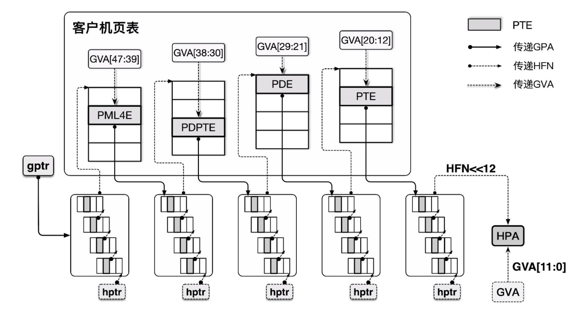

# 内存虚拟化

内存虚拟化本质上是需要达成以下两个目的：

- 提供一个在 Guest 感知中的从零开始的连续物理内存空间。
- 在各个 VM 之间进行有效的隔离、调度、共享内存资源。

## 纯软件实现内存虚拟化

### 虚拟机内存访问原理及遇到的问题

为了实现内存空间的隔离，Hypervisor 需要为 Guest VM 准备一层新的地址空间：`Guest Physical Address Space`，从 Guest 侧其只能看到这一层地址空间，Hypervisor 需要记录从 GPA 到 HVA 之间的转换关系。

下图为 Qemu 的内存架构：

```
Guest' processes
                     +--------------------+
Virtual addr space   |                    |
                     +--------------------+                                    （GVA）
                     |                    |
                     \__   Page Table     \__
                        \                    \
                         |                    |  Guest kernel
                    +----+--------------------+----------------+
Guest's phy  memory |    |                    |                |            （GPA）
                    +----+--------------------+----------------+
                    |                                          |
                    \__                                        \__
                       \                                          \
                        |             QEMU process                 |
                   +----+------------------------------------------+
Virtual addr space |    |                                          |         （HVA）
                   +----+------------------------------------------+
                   |                                               |
                    \__                Page Table                   \__
                       \                                               \
                        |                                               |
                   +----+-----------------------------------------------+----+
Physical memory    |    |                                               |    |    （HPA）
                   +----+-----------------------------------------------+----+
```

当我们要访问 Guest 中某个虚拟地址上的数据时，我们需要：

- 首先得先通过 Guest 的页表将 `Guest Virtual Address` （GVA）转换为 `Guest Physical Address`（GPA）。
- GPA 在 Qemu 的实现当中实际上是对应映射到 Host 中一大块 mmap 的内存上的，所以我们还需要将 GPA 再转换为 `Host Virtual Address`（HVA）。
- 最后再通过 Host 上的页表将 HVA 转化为 `Host Physical Address`（HPA）。
- 在 Guest 多级页表的寻址当中同样也要多次经过 `GPA->HPA` 的转换查询过程。

这一整套流程**非常繁重**，从而使得虚拟机中内存访问的性能极为低下。

> 在 QEMU 当中访问内存的核心函数是 `address_space_rw()`，实现了 `GPA->HVA`，感兴趣的同学可以看一下其内部实现。

### 影子页表 （shadow page table）

在早期的时候 Intel 硬件对虚拟化并没有很好的支持，因此 Hypervisor 只能先在软件层面进行优化——**影子页表**（Shadow Page Table）应运而生。

以 Intel 为例，由于读写 CR3 寄存器（存放页顶级表指针）的操作是敏感指令，我们的 Hypervisor 可以很轻易地截获 VM 的这个操作，**并将页表替换为存放 GVA→HPA 映射关系的影子页表**，这样就能**直接完成由 GVA 到 HPA 的转换过程**。


为了实现影子页表，我们本质上需要实现**MMU 虚拟化**：

- Guest VM 所能看到与操作的实际都上是虚拟的 MMU，真正载入 MMU 的页表是由 Hypevisor 完成翻译后所产生的**影子页表**。
- 影子页表中的访问权限为**只读的**，当 Guest 想要读写页表时便能被 Hypervisor 捕获到这个操作并代为处理。

不过这种方法的缺点就是**我们需要为 Guest VM 中的每套页表都独立维护一份影子页表，且需要多次在 VMM 与 VM 间进行切换**，这有着不小的开销。

## 硬件辅助虚拟化

### 扩展页表（Extend Page Table, EPT）

从软件层面似乎已经是难以有更好的优化的方案了，因此硬件层面的对内存虚拟化的支持便应运而生——**EPT** 即 **Extend Page Table**，是 Intel 为实现内存虚拟化而新增的特性，目的是为了减少内存访问的开销。

EPT 并不干扰 Guest VM 操作自身页表的过程，其本质上是**额外提供了一个 Guest 物理地址空间到 Host 物理地址空间转换的页表**，即使用一个额外的页表来完成 `GPA→HPA` 的转换。

EPT 方案虽然相比起影子页表而言多了一层转换，但是并不需要干扰 Guest 原有的页表管理，**GVA→GPA→HPA 的过程都由硬件自动完成**，同时 Hypervisor 仅需要截获 `EPT Violation` 异常（EPT 表项为空），效率提高了不少。



### VPID：TLB 资源优化

**Translation Lookaside Buffer**为用以加快虚拟地址到物理地址转换的**页表项缓存**，当进行地址转换时 CPU 首先会先查询 TLB，TLB 根据虚拟地址查找是否存在对应的 cache，若 cache miss 了才会查询页表。

由于 TLB 是与对应的页表进行工作的，因此在切换页表时 TLB 原有的内容就失效了，此时我们应当使用 `INVLPG` 使 TLB 失效，类似地，在 VM-Entry 与 VM-Exit 时 CPU 都会强制让 TLB 失效，但这么做仍存在一定的性能损耗。

**Virtual Processor Identifier**（VPID）则是一种硬件级的对 TLB 资源管理的优化，其在硬件上为每个 TLB 表项打上一个 VPID 标识（VMM 为每个 vCPU 分配一个唯一的 VPID，存放在 VMCS 中，逻辑 CPU 的 VPID 为 0），在 CPU 查找 TLB cache 时会先比对 VPID，这样我们就无需在每次进行 VM entry/exit 时刷掉所有的 cache，而可以继续复用之前保留的 cache。

## REFERENCE

《系统虚拟化：原理与实现》——Intel 开源软件技术中心 著

[【VIRT.0x02】系统虚拟化导论](https://arttnba3.cn/2022/08/29/VURTUALIZATION-0X02-BASIC_KNOWLEDGE/)

《深度探索 Linux 系统虚拟化》——王柏生、谢广军 著