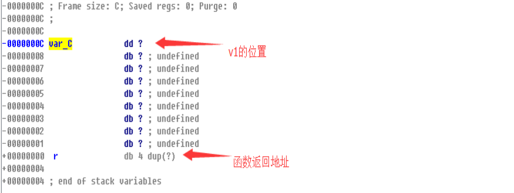
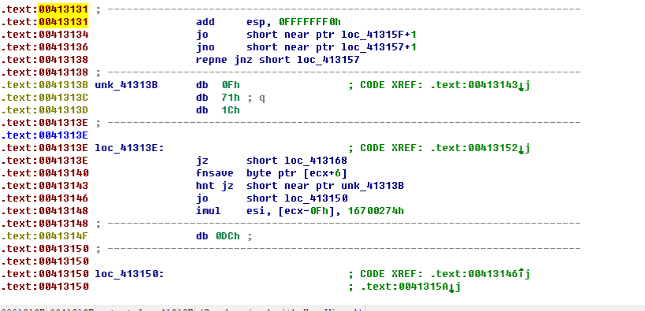
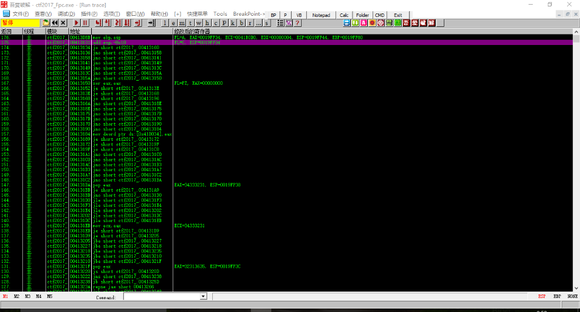
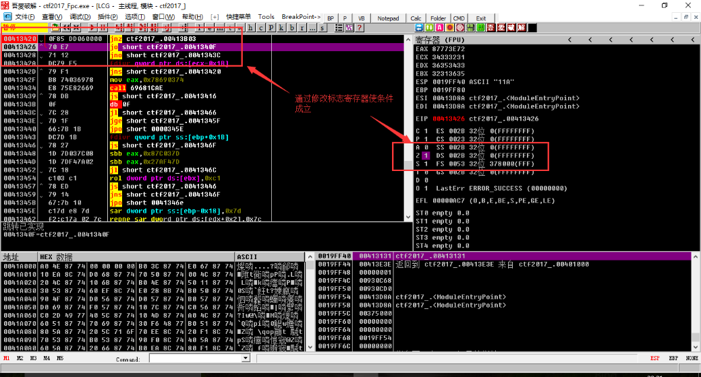

# 花指令

## 原理

花指令是企图隐藏掉不想被逆向工程的代码块(或其它功能)的一种方法, 在真实代码中插入一些垃圾代码的同时还保证原有程序的正确执行, 而程序无法很好地反编译, 难以理解程序内容, 达到混淆视听的效果.

花指令通常用于加大静态分析的难度。

## 编写

最简单的花指令使用了内联汇编的方式进行，下面以 VC 添加花指令的方式举例，gnu 的编译器也可以采用类似的方式添加花指令，但是使用 AT&T 汇编：

```c
// 正常的函数代码
int add(int a, int b){
  int c = 0;
  c = a + b;
  return c;
}
// 添加花指令的函数代码
int add_with_junk(int a, int b){
	int c = 0;
	__asm{
		jz label;
		jnz label;
		_emit 0xe8;    call 指令，后面加4bytes的地址偏移，因此导致反汇编器不能正常识别
label:
	}
	c = a + b;
	return c;
}

```

使用 ida 的反编译时，添加了花指令的函数不能正常识别，结果如下：

伪代码：

```asm
// 添加了花指令
.text:00401070 loc_401070:                             ; CODE XREF: sub_401005↑j
.text:00401070                 push    ebp
.text:00401071                 mov     ebp, esp
.text:00401073                 sub     esp, 44h
.text:00401076                 push    ebx
.text:00401077                 push    esi
.text:00401078                 push    edi
.text:00401079                 lea     edi, [ebp-44h]
.text:0040107C                 mov     ecx, 11h
.text:00401081                 mov     eax, 0CCCCCCCCh
.text:00401086                 rep stosd
.text:00401088                 mov     dword ptr [ebp-4], 0
.text:0040108F                 jz      short near ptr loc_401093+1
.text:00401091                 jnz     short near ptr loc_401093+1
.text:00401093
.text:00401093 loc_401093:                             ; CODE XREF: .text:0040108F↑j
.text:00401093                                         ; .text:00401091↑j
.text:00401093                 call    near ptr 3485623h
.text:00401098                 inc     ebp
.text:00401099                 or      al, 89h
.text:0040109B                 inc     ebp
.text:0040109C                 cld
.text:0040109D                 mov     eax, [ebp-4]
.text:004010A0                 pop     edi
.text:004010A1                 pop     esi
.text:004010A2                 pop     ebx
.text:004010A3                 add     esp, 44h
.text:004010A6                 cmp     ebp, esp
.text:004010A8                 call    __chkesp
.text:004010AD                 mov     esp, ebp
.text:004010AF                 pop     ebp
.text:004010B0                 retn
```

在上面这个例子中，把混淆视听的花指令 patch 成 nop 即可修复，然后正常分析。

值得注意的是，ida 对于栈的判定比较严格，因此 push，ret 一类的花指令会干扰反汇编器的正常运行，下面给出一个具体的例子，读者可以自己编译复现：

```c++
#include <stdio.h>
// 使用 gcc/g++ 进行编译
int main(){
	__asm__(".byte 0x55;");          // push rbp   保存栈 
	__asm__(".byte 0xe8,0,0,0,0;");  // call $5;	
	__asm__(".byte 0x5d;");	         // pop rbp -> 获取rip的值 
	__asm__(".byte 0x48,0x83,0xc5,0x08;"); // add rbp, 8
	__asm__(".byte 0x55;");          // push rbp -> 相当于将call的返回值修改到下面去
	__asm__("ret;");
	__asm__(".byte 0xe8;");          // 这是混淆指令不执行
	__asm__(".byte 0x5d;");          // pop rbp 还原栈		
	printf("whoami \n");
	return 0;
} 
```


## 例题

这里以`看雪.TSRC 2017CTF秋季赛`第二题作为讲解. 题目下载链接: [ctf2017_Fpc.exe](https://github.com/ctf-wiki/ctf-challenges/blob/master/reverse/anti-debug/2017_pediy/ctf2017_Fpc.exe)

程序写了几个函数混淆视听, 将关键的验证逻辑加花指令防止了IDA的静态分析. 我们用IDA打开Fpc这道题, 程序会先打印一些提示信息, 然后获取用户的输入.


这里使用了不安全的`scanf`函数, 用户输入的缓冲区只有`0xCh`长, 我们双击`v1`进入栈帧视图



因此我们可以通过溢出数据, 覆盖掉返回地址, 从而转移到任意地址继续执行.

这里我还需要解释一下, 就是`scanf`之前写的几个混淆视听的函数, 是一些简单的方程式但实际上是无解的. 程序将真正的验证逻辑加花混淆, 导致IDA无法很好的进行反编译. 所以我们这道题的思路就是, 通过溢出转到真正的验证代码处继续执行.

我们在分析时可以在代码不远处发现以下数据块.


因为IDA没能很好的识别数据, 因此我们可以将光标移到数据块的起始位置, 然后按下`C`键(code)将这块数据反汇编成代码



值得注意的是, 这段代码的位置是`0x00413131`, `0x41`是`'A'`的ascii码，而`0x31`是`'1'`的ascii码. 由于看雪比赛的限制, 用户输入只能是字母和数字, 所以我们也完全可以利用溢出漏洞执行这段代码

用OD打开, 然后`Ctrl+G`到达`0x413131`处设下断点, 运行后输入`12345612345611A`回车, 程序成功地到达`0x00413131`处. 然后`右键分析->从模块中删除分析`识别出正确代码


断在`0x413131`处后, 点击菜单栏的`"查看"`, 选择`"RUN跟踪"`, 然后再点击`"调试"`, 选择`"跟踪步入"`, 程序会记录这段花指令执行的过程, 如下图所示:



这段花指令本来很长, 但是使用OD的跟踪功能后, 花指令的执行流程就非常清楚. 整个过程中进行了大量的跳转, 我们只要取其中的有效指令拿出来分析即可.

需要注意的是, 在有效指令中, 我们依旧要满足一些条件跳转, 这样程序才能在正确的逻辑上一直执行下去.

比如`0x413420`处的`jnz ctf2017_.00413B03`. 我们就要重新来过, 并在`0x413420`设下断点


通过修改标志寄存器来满足跳转. 继续跟踪步入(之后还有`0041362E  jnz ctf2017_.00413B03`需要满足). 保证逻辑正确后, 将有效指令取出继续分析就好了


